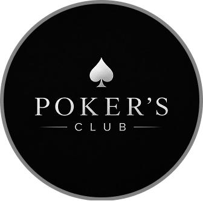

<h1 align="center"> Poker's Club Links </h1>

Página agregadora de links oficial do Poker's Club, desenvolvida com alternância de tema claro/escuro.

<!--

 
  <a href="#-tecnologias">Tecnologias</a>&nbsp;&nbsp;&nbsp;|&nbsp;&nbsp;&nbsp;
  <a href="#-projeto">Projeto</a>&nbsp;&nbsp;&nbsp;|&nbsp;&nbsp;&nbsp;
  <a href="#-acesso">Acesso Online</a>&nbsp;&nbsp;&nbsp;|&nbsp;&nbsp;&nbsp;
  <a href="#memo-licença">Licença</a>

-->

  
    Poker´s Club Oficial  

 

##  Tecnologias

Esse projeto foi desenvolvido com as seguintes tecnologias:

- HTML
- CSS (CSS, Flexbox, Layout Responsivo)
- JavaScript (Manipulação do DOM e alternância de temas)
- Git e GitHub
- Figma

##  Projeto

O **Poker's Club Links** é um agregador de links personalizado (estilo Linktree) criado para reunir os canais sociais e pontos de contato do clube de pôquer, permitindo alternar de forma interativa entre o modo escuro e claro por meio de um switch customizado.

##  Acesso Online

Você pode visualizar e testar o projeto funcionando diretamente pelo navegador:

- [Acessar Instagram Poker's Club](https://viniciusvicario.github.io/Projeto-Poker-s-Club/)

##  Licença
Esse projeto está sob a licença MIT.

---

Feito com dedicação para o **Poker's Club**! 